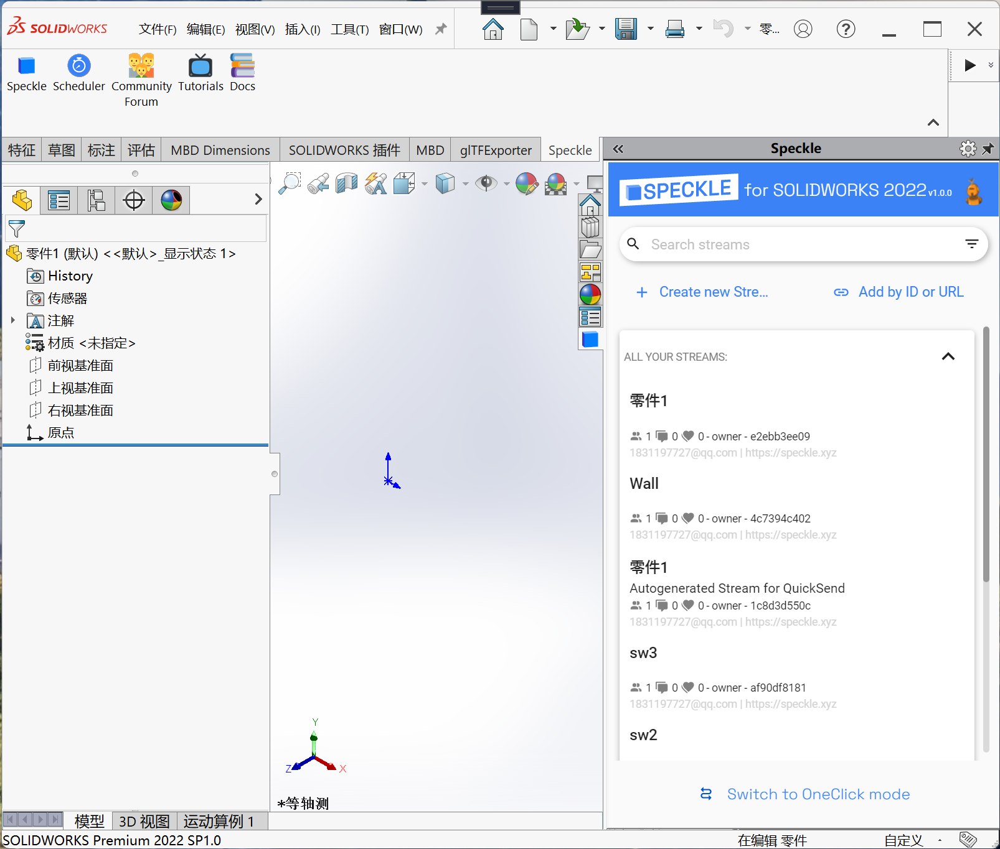

# speckle-solidworks

**under development**

## SolidWorks Objects

| SolidWorks Type | Part | Assembly | Drawing | State(Send) |
| --- | --- | --- | --- | --- |
| Feature | :heavy_check_mark: | :heavy_check_mark: | :x: |
| Body | :heavy_check_mark: | :heavy_check_mark: | :x: | :white_check_mark: (Mesh only now) |
| Component | :x: | :heavy_check_mark: | :x: | :white_check_mark: 
| Sketch | :heavy_check_mark: | :heavy_check_mark: | :heavy_check_mark: |
| SketchPoint | :heavy_check_mark: | :heavy_check_mark: | :heavy_check_mark: |
| SketchSegment | :heavy_check_mark: | :heavy_check_mark: | :heavy_check_mark: |
| CustomProperty | :heavy_check_mark: | :heavy_check_mark: | :heavy_check_mark: | :white_check_mark: 
| Dimension | :heavy_check_mark: | :heavy_check_mark: | :heavy_check_mark: | 
| Mate | :x: | :heavy_check_mark: | :x: | 
| Equations | :heavy_check_mark: | :heavy_check_mark: | :heavy_check_mark: | :white_check_mark: 

## UI Resources

[Figma](https://www.figma.com/community/file/1259478907213353448)